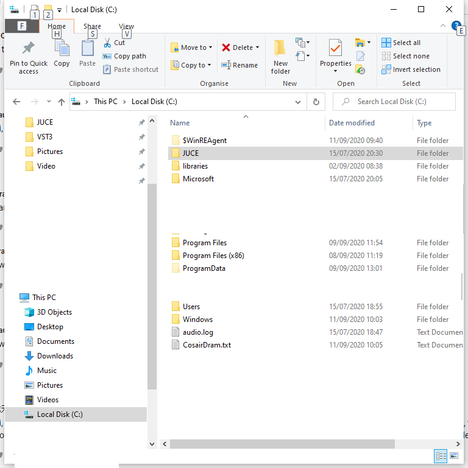
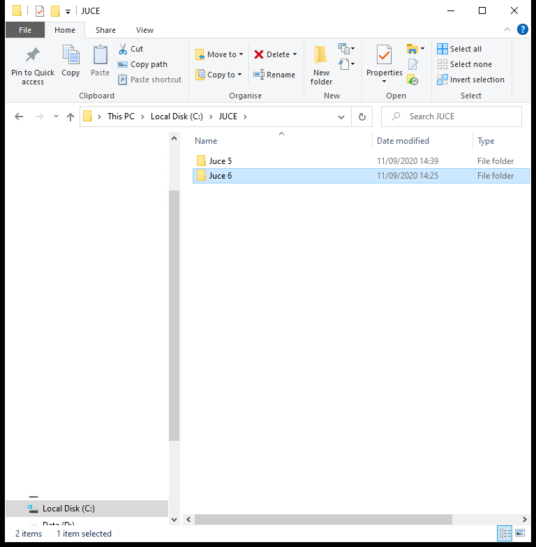
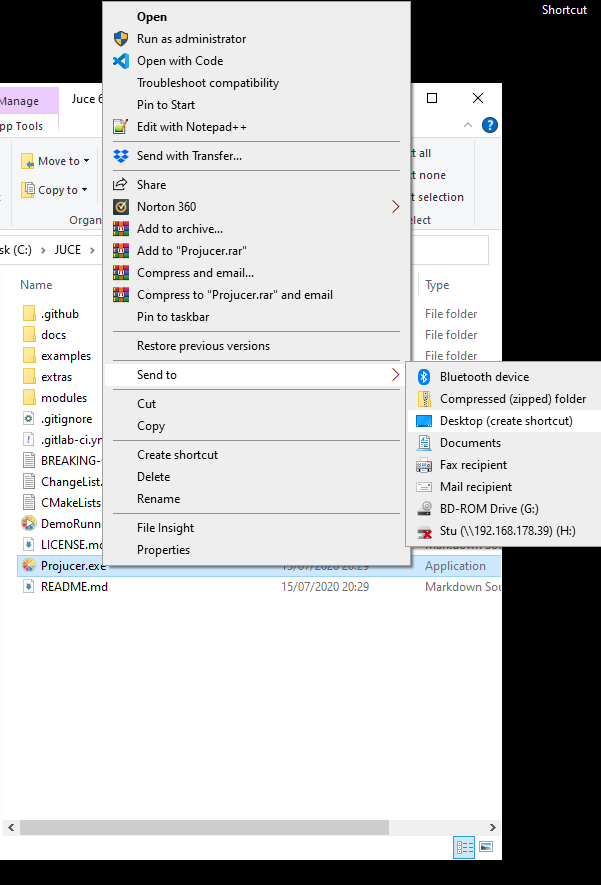
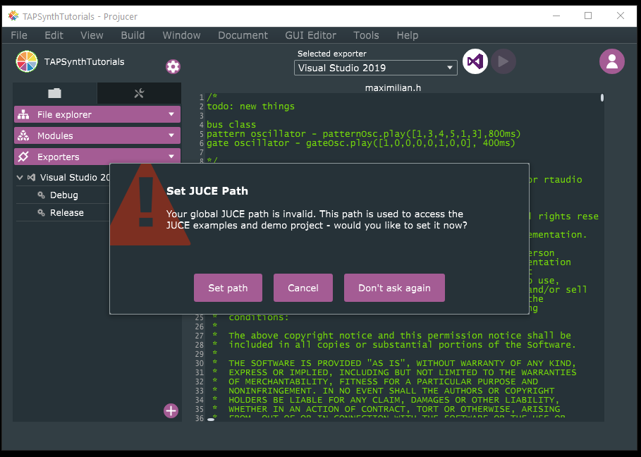
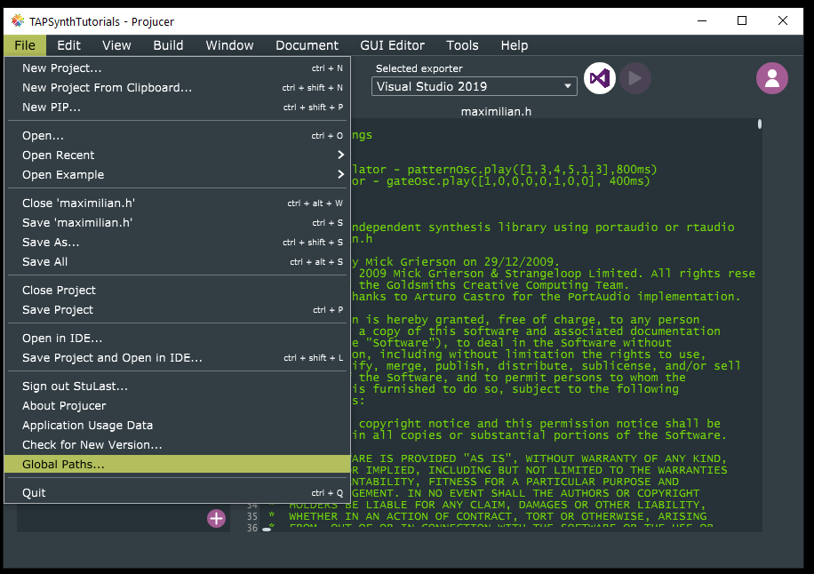
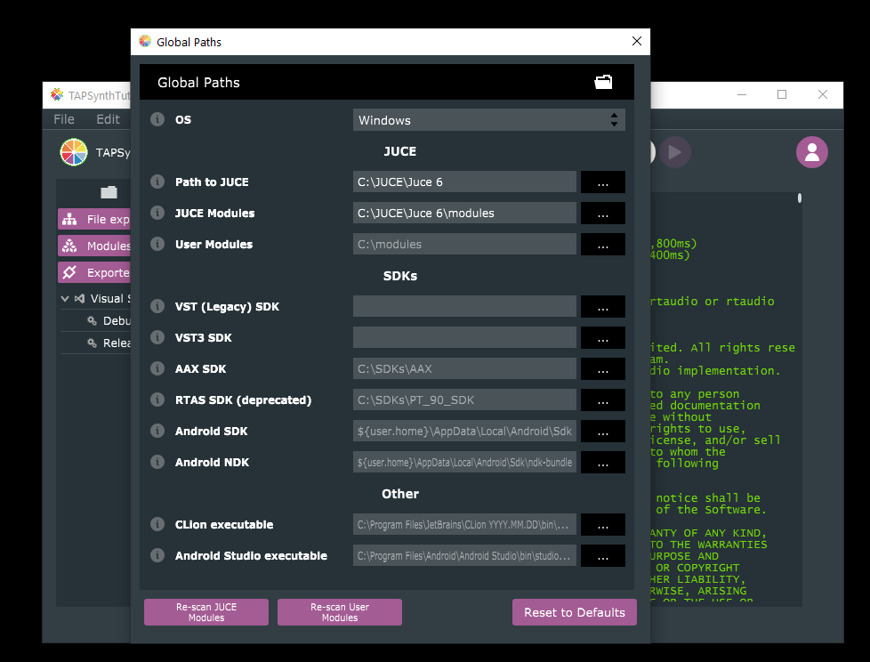

[Home](../README.md) |

# Tutorial 00 - How to Explore the JUCE Repository and New Features

[Go To Video On YouTube](https://youtu.be/3GyQhLwb3J8)

[Tutorial_00 Index](./Tutorial_00.md)
[Tutorial Transcript](./Transcript.md)

## Supplemental

This YouTube tutorial was published before Juce 6 was formerly released.  Juce 6 is now available as a download from http://juce.com .

##  Multiple, simultaneous versions of Juce using dowloads from Juce Website.

It is entirely possible for multiple versions of Juce to coexist on the same machine and to be accessed independently without rebuilding, although it does take a little organisation and appropriate naming.  The following example is shown for Windows users.

Juce can be stored anywhere on your drives, although permanent drives are better suited to build environments than USB/Portable drives.  In this example we are going to install  side by side, and create links to the appropriate Projucer.  I'm assuming that, for Windows user, the C:drive is the default drive.

###  Creating space for multiple versions of Juce...

On the C:/ Drive create a folder called "JUCE" at the root (top level)




Within this Juce folder, you can create additional folder levels for different versions of Juce.  In this example we are working with an existing installation of Juce 5, which I have moved into the "C:/JUCE/Juce 5" folder and will install a copy of Juce 6 in the "C:/JUCE/Juce 6" folder.



Windows keeps a track of .exe files when they move folders, so there should be no need for the next step, but in case it doesn't work as expected, you can still create a new link to the Juce 5 Projucer by going into the Juce 5 folder, locating the Projucer.exe file, right clicking it and selecting "Send to > Desktop".  Once a link has been created on your desktop, you can rename it by right clicking on the link, choosing "rename" and entering your own name for the link.  I've chosen "Projucer 5".



Now that the Juce 5 install has been moved we're going to encounter an issue with the location of Juce modules etc.  To fix this open up your newly created Juce 5 link from you desktop (or from the C:/JUCE/Juce 5 folder).  Ignore any "Update to Juce 6" prompts, log in if necessary and you should see an dialog box with the message "Set JUCE path".  This is what allows us to have multiple versions of JUCE on our system.  Click on the "Set Path" button.  If the message does not appear, go to "File > Global Paths" to set your paths.



Near the top of the "Global Paths" form, yo'll see fields for "Path to JUCE" and "JUCE modules".  If you've been following along using the same drive and folder structure as me, the "Path to JUCE" for the JUCE 5 installation should be "C:\JUCE\Juce 5" and the path to "JUCE Modules" should be "C:\JUCE\JUCE 5\modules".  You can either enter this information in manually or, like me, be certain and use the elipsis to open a file browser to navigate to the right folder (better safe than spend hours debugging).

To test that all has gone well, you can now use the JUCE 5 Projucer to create a new project, open it up in Visual Studio (or whatever your preferred IDE is), and build the project.

These steps of moving JUCE 5 from the C:\JUCE directory to a specific C:\JUCE\Juce 5 directory shows the flexibility we have with where to install JUCE and this is what gives us the power to install a different version of JUCE on our computer, which is what we'll cover next.

### Installing that second version of JUCE...

Now that we've made space for a second version of JUCE we can now download the latest version of JUCE directly from http:/juce.com.  Once downloaded, the zip file can be extracted and content copied into "C:\JUCE\Juce 6".  We repeat the steps used for our "Juce 5" install above insofar as we create a shortcut on our desktop, rename the shortcut and double click on it.  This time, though, the UI looks a little different so to make sure our Projucer 6 is looking at the correct folder these steps are just a little different.

Open up the JUCE 6 Projucer, either by clicking on the newly created (and renamed) desktop shortcut, or by navigating to the C:\JUCE\Juce 6 in our folder hierarchy.  Once any "update" messages have been ignored, and you're logged in, navigate to "File > Global Paths" and set your global paths.






### Switching between Projucer Versions.

The downside is that, regardless of which version of Projucer you're using, it is currently hard-wired into the Projucer software to read your settings from a single file contained in (on Windows) , C:\Users\username\AppData\Roaming\Projucer\Projucer.settings.  The upside is that the workaround is no hardship, and is certainly easier than switching branches and rebuild Projucer each time you want to work on a different version.

There are 2 ways of achieving the switch.

### Method 1.  

Open up the file C:\Users\username\AppData\Roaming\Projucer\Projucer.settings with any text editor.  near the top of the file you'll see  
``` <VALUE name="PROJECT_DEFAULT_SETTINGS">
    <PROJECT_DEFAULT_SETTINGS jucePath="C:\JUCE\Juce 6" defaultJuceModulePath="C:\JUCE\Juce 6\modules"/>
  </VALUE>
```

Simply edit the jucePath value and defaultJuceModulePath value to point to your preferred Juce version (an obvious and simple folder naming scheme comes in handy here)

### Method 2.

As described in the initial set up of the 2 versions of Juce on your computer, you can open up either Projucer version (it doesn't matter which one as you'll have to restart it anyway), go to "File > Global Paths" and change the path to your preferred version of JUCE.  Close and Reopen Projucer to apply the changes.

##  Getting specific "branches" from Github and installing them in branch specific Folders.

There is a little used way of getting a branch from GitHub (or any other Git Repo Service) and cloning it to it's own "branch specific" folder.  This can be very useful if, for example, you wanted to clone and run different branches of JUCE on your computer.  In this example, we'll clone the Master Branch of Juce and the Development Branch of Juce into separate folder on our computer in our already created "C:\JUCE" folder.

Assuming you've already got GitBash installed (see below for more information), you can right click on the C:\Juce folder to open the context menu, and open up a GitBash terminal instance, or you can open up GitBash from your start menu and navigate to the appropriate folder.  Note that Gitbash uses linux style shell commands so it's "ls" not "dir" to get a directory/file listing.

Once you've got your GitBash terminal open you can use it to grab individual branches and assign them to specific folders.

In the case of JUCE, we can use the following to grab the master branch and assign it to a folder I'm going to call "stable"

```
git clone https://github.com/juce-framework/JUCE  --single-branch -b master stable
```

The --single-branch flag is self explanatory, the "-b" flag defines the specific branch you wish to grab ("master").  The very last argument is the target directory, which cannot already exist and will be created during the cloning process.   If you now ``` cd stable```  you will see you have the Juce repo within it.  If you then ```git branch``` it should only show the "master" branch.  

We can repeat the process for the "develop" branch, which I'm going to put in a folder called "experimental"

```
git clone https://github.com/juce-framework/JUCE --single-branch -b develop experimental
```

You can than build each independently without the need to keep switching branches and, using the method described above, easily switch between Projucer and Juce versions.

## A word about github "Releases"

Another way that Git offers for keeping a history of code is through the use of "Releases".  A Release us a tag that the developers attach to a particular point in a projects evolution to denote a version of the software.  In this supplemental on JUCE, we've been talking in terms of JUCE 5 and JUCE 6, which are major releases, but many people are familiar with finer granularity of releases such as JUCE 5.4.1. which is a sub-release that will normally contain fixes, performance improvements and minor changes but do not normally signigy a major change in the UI or functionality of the software.

Getting hold of specific releases is very much like getting hold of a specific branch because Git treats the Release "tag" as a branch name.  For exammple, if you wanted to get JUCE 5.3.2 you could use the following clone statement

```git clone https://github.com/juce-framework/JUCE --single-branch -b 5.3.2 "Juce 5.3.2" ```

*Note the use of quotation marks to denote a target folder containing spaces and fulls stops.

You can then use one of the two methods for switching JUCE version already described above to point to the appropriate modules and folders.


##  What is the GitSCM, GitBash and how to get hold of them.

Git bash is a terminal "shell" used to interact with the computer file system and git via a terminal (also known as a command line interface or command prompt).  On windows you can download and install it from https://gitforwindows.org/.  The cool thing about git for windows is that, as well as adding access to git commands to your computer, it also adds a contextual link (open from file and folder by right clicking) and it gives windows users access to linux style shell commands - pretty useful when working in mixed teams.

On MacOSX, the easiest way to get hold of the Git SCM is to install Xcode as this comes pre-packaged.

For Linux users you may need to check for instructions on your own particular Linux flavour, but when I last checked, Git was pretty ubiqitous, and so something as simple as ```apt-get install git``` or ```yum install git``` should do the trick (not forgetting ```sudo``` if you require the permissions).#

##